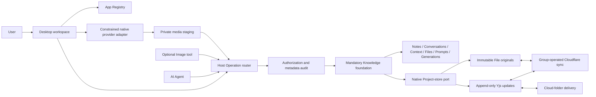

# MyBox system overview

Knowledge is the mandatory shared record foundation. Optional tools keep private
execution state and use Host-authorized Operations for records. This overview
reflects ADRs 0040–0054; historical ADRs retain their original implementation notes.

## Current architecture

The diagram describes ownership and transport boundaries, not an alternative
call path: all App record operations require authorization. Provider adapters
receive explicit inputs and never receive an App storage port or workspace path.

## Current implementation boundary

- Knowledge is required; optional App removal does not remove shared records.
  Registry versions control installed Surface availability, not permissions.
- Notes, Conversations, Context notebooks, Files, user Prompts and Generation
  Pages share stable Project/Page identities and authorized search. Immutable
  records are extracted into Notes when editable derivatives are needed.
- Context recording defaults on. One notebook per conversation lives in a private
  Record Project; source references may span authorized Projects. Selected turns
  can be copied explicitly to a shared Project as fixed records.
- Project stores contain append-only Yjs updates and immutable File originals.
  The Host validates paths and manifests. Cloud-folder delivery and Cloudflare
  collaboration operate on the same document, independently of one another.
- The current Knowledge schema/native manifest is 5; record sync protocol is 4.
  Earlier endpoints must be updated before these clients reconnect.
- Search, tags, stored PageLinks and the workspace graph provide navigation.
  Graph affinities are temporary lexical/tag relationships, not semantic
  retrieval or newly persisted links. Former Folders become ordinary link Notes.
- Image migrates user templates and generation records into Knowledge with
  backups, restartable mappings and verified originals. Provider caches, drafts
  and resume state remain private. Chat history uses its own Host migration
  adapter; neither legacy content store receives new record writes after cutover.
- Desktop Workflow UI and execution are retired. Saved definitions/history and
  opt-in compatibility tests remain; hidden schedules do not run.
- Web preview uses memory storage. It does not verify native persistence, IME,
  Windows DPI or actual provider execution.

## Remaining extensions

PDF text extraction/OCR, Chunks and semantic retrieval, Obsidian interchange,
change-proposal application and richer grant constraints remain future work.
Safe Yjs log compaction and unreferenced-resource collection need retention
policies; migration does not delete old backups or resources automatically.

See [migration status](migration-status.md) for release and workspace verification.
