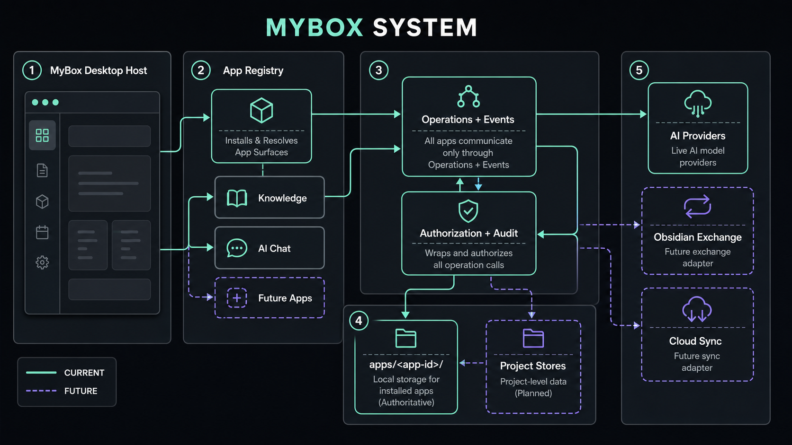
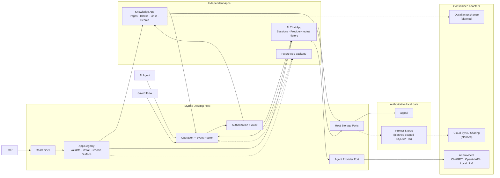

# MyBox system overview

The generated overview distinguishes current paths with solid mint lines and
planned paths with dashed violet lines. The exact architecture is defined below;
this Mermaid diagram is authoritative when a raster label or connector is
ambiguous.

## Current implementation boundary

- The App Registry validates stable IDs and Surface contracts and resolves the
  Knowledge Surface lazily. Registered Apps can be removed and added again from
  the launcher without introducing another App-specific render branch. Installed
  IDs and custom generic metadata persist in the current device's Host namespace.
- Apps still declare Operations and events separately. Registry membership does
  not grant storage, caller, provider, or Project access.
- App-common local state currently uses `apps/<app-id>/`. The Knowledge vertical
  slice still uses App-scoped JSON while Project stores, SQLite/FTS, Obsidian
  exchange, cloud synchronization, and realtime collaboration remain planned.
